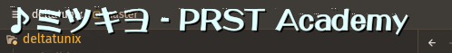

# DeltaTunix

A portable clone of Toastworth's [DeltaTune](https://github.com/ToadsworthLP/deltatune) for Linux, an overlay that shows the title and artist of whatever song you're playing.
This uses the MPRIS DBus interface to check for running media players.
Should run on X11 and Wayland under XWayland (sorry native wayland users!)




Made with raylib and primarily made because I'm bored as hell.

# Features

- It's literally just DeltaTune on Linux
- Allows some more customization
- An optional style that emulates how the Touhou series uses the indicator
	- Functionality to change fonts and styling of the text

# Compiling

You will need:

- CMake (atleast 3.5+)
- raylib [6.x]
- sdbus-c++
- Fontconfig
- Freetype
- Qt 6 (when building with tray)
- A compiler that supports atleast C++20 (which is most nowadays...)

This uses the CMake build system for building.

```bash
cmake -B build
cmake --build build -DBUILD_SYSTRAY=ON # On by default; Set this to off to prevent building the system tray module
./run.sh # This will run the program
```

# Running

Just run the compiled `deltatunix` executable! That's it.

If you compiled with the system tray module, there should be a system tray icon at your taskbar, allowing you to reload your config without restarting the program.

# Known Issues

- Stray pixels when the text has an outline.

# License

This program is licensed under the zlib license.
